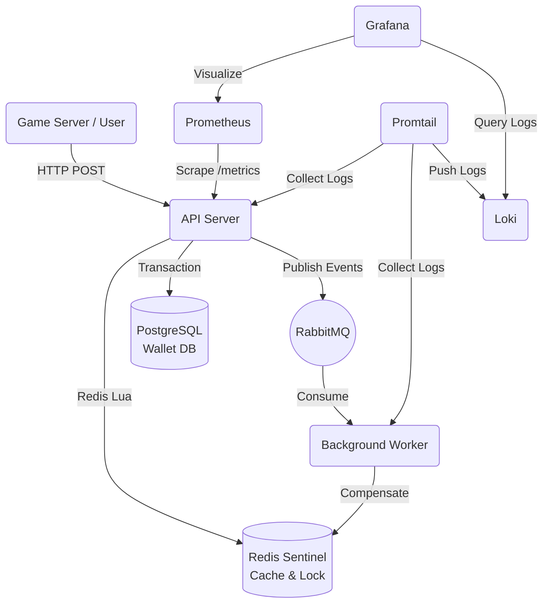

# Nexus Gaming Core (Wallet System)


Nexus Gaming Core 是一個為高併發遊戲場景設計的**錢包與金流核心系統**。支援極高 QPS 的餘額扣款 (Bet) 與派彩 (Win)，並透過多層架構確保資料的**最終一致性 (Eventual Consistency)**、**冪等性防重 (Idempotency)** 以及**ACID 交易完整性**。

## 🌟 核心特色 (Key Features)

- **Clean Architecture (乾淨架構)**：嚴格遵守依賴反轉原則，由外而內分為 Delivery (HTTP/Gin)、Infrastructure (Postgres/Redis/RabbitMQ)、Usecase (業務邏輯) 與 Domain (核心實體與介面)，並導入 `UnitOfWork` 模式封裝資料庫交易。
- **高併發與防重 (High Concurrency & Idempotency)**：
  - 第一道防線：透過 Redis Lua Script 達到原子級的餘額預扣與防重鎖 (Distributed Lock)。
  - 第二道防線：PostgreSQL 悲觀鎖 (`SELECT FOR UPDATE`) 確保底層資料強一致。
- **非同步補償機制 (Asynchronous Compensation)**：當資料庫 Commit 失敗或網路斷線時，系統會送出 `CompensationEvent` 到 RabbitMQ，由背景 Worker 進行 Redis 餘額逆向補償，確保資料最終一致。
- **全面可觀測性 (Comprehensive Observability)**：
  - **Metrics (Prometheus)**：內建 Prometheus Exporter 收集 API QPS、Latency (P99)、HTTP 狀態碼。
  - **Logs (Loki + Promtail)**：透過 Promtail 自動收集所有 Docker Container 的日誌，並統一匯集到 Loki 集中管理。
  - **Dashboards (Grafana)**：透過 Docker Compose 一鍵啟動 Grafana 與預先配好的上帝視角儀表板，支援 Metrics 觀測與 Loki 日誌查詢。
  - **Tracing**：全域導入 `go.uber.org/zap` 結構化 JSON 日誌，並利用 Middleware 注入 `TraceID` 貫穿 API 到 Worker 的整個生命週期。
- **自動化壓測**：內建 K6 壓測腳本，可模擬真實老虎機 (Slot Machine) 持續 Spin 的極限扣款場景。

## 🏗️ 架構圖 (Architecture)



## 🚀 快速開始 (Getting Started)

### 先決條件 (Prerequisites)
- [Docker](https://docs.docker.com/get-docker/) & Docker Compose
- [Make](https://www.gnu.org/software/make/) (Windows 可使用 Git Bash 或 WSL)

### 啟動完整環境
這會一次把 PostgreSQL, Redis Sentinel, RabbitMQ, API Server, Worker, Prometheus, Loki, Promtail 與 Grafana 啟動起來。
```bash
make db-up
```

### 檢視 Grafana 儀表板與日誌
- **網址**: `http://localhost:3000`
- **帳號密碼**: `admin` / `admin`

**1. 檢視 Metrics (效能指標)**
登入後，進入 **Dashboards** 即可看到預先設定好的 **Nexus Gaming Core Observability** 儀表板，即時監控 QPS 與 P99 延遲。

**2. 檢視 Logs (應用程式日誌)**
點選左側選單的 **Explore (指南針圖示)**：
- 左上角資料來源選擇 **Loki**。
- 點選 `Label filters`，選擇 `container` 標籤，然後挑選 `/nexus_api_server` 或 `/nexus_worker` 即可搜尋對應的 Zap JSON 日誌。
- 你可以利用 `trace_id` 欄位來追蹤單一交易的完整生命週期。

### 進行 K6 壓力測試
系統啟動後，你可以對金流 API 進行極限壓測（預設為 50 個 VU 持續 10 秒）。
1. (可選) 資料庫初始化時預設已給予測試玩家 1000 元餘額。由於壓測非常猛烈，餘額可能會在幾秒內耗盡，此時 API 會回傳 `402 Insufficient Funds` (這也是預期的阻擋行為)。若你想讓全部請求都是 200 OK，可以先用以下指令充值 10,000 元：
   ```bash
   curl -X POST http://localhost:8080/api/v1/wallet/transaction \
   -H "Content-Type: application/json" \
   -d '{"user_id":1,"currency":"TWD","type":"DEPOSIT","amount":"10000.00","provider_id":"ADMIN","provider_tx_id":"init_fund_01","reference_id":""}'
   ```
2. 啟動壓力測試：
   ```bash
   make test-load
   ```
3. 在終端機與 Grafana 儀表板上觀察 QPS、錯誤率以及 P99 延遲！

## 📁 目錄結構

```text
.
├── cmd/
│   ├── server/          # API Server 啟動入口
│   └── worker/          # 背景 Worker 啟動入口
├── deploy/              # Prometheus, Grafana, Loki 與 Promtail 的佈署設定檔
├── internal/
│   ├── delivery/        # HTTP Handlers 與路由 (Gin)
│   ├── domain/          # 領域模型、介面、錯誤定義 (Clean Architecture Core)
│   ├── infrastructure/  # PostgreSQL, Redis, RabbitMQ 實作與 UnitOfWork
│   └── usecase/         # 核心業務邏輯
├── pkg/
│   ├── logger/          # Zap Logger 與 TraceID 封裝
│   └── metrics/         # Prometheus 指標定義
├── scripts/             # 資料庫 Schema 初始化腳本
├── tests/               # K6 壓力測試腳本
├── docker-compose.yml   # 基礎建設編排
└── Makefile             # 開發與測試常用指令
```

## 🛑 停止與清理

停止所有服務，但保留資料庫資料 (Volumes)：
```bash
make db-down
```
若要徹底清除資料，請加上 `-v` 參數：
```bash
docker-compose down -v
```
